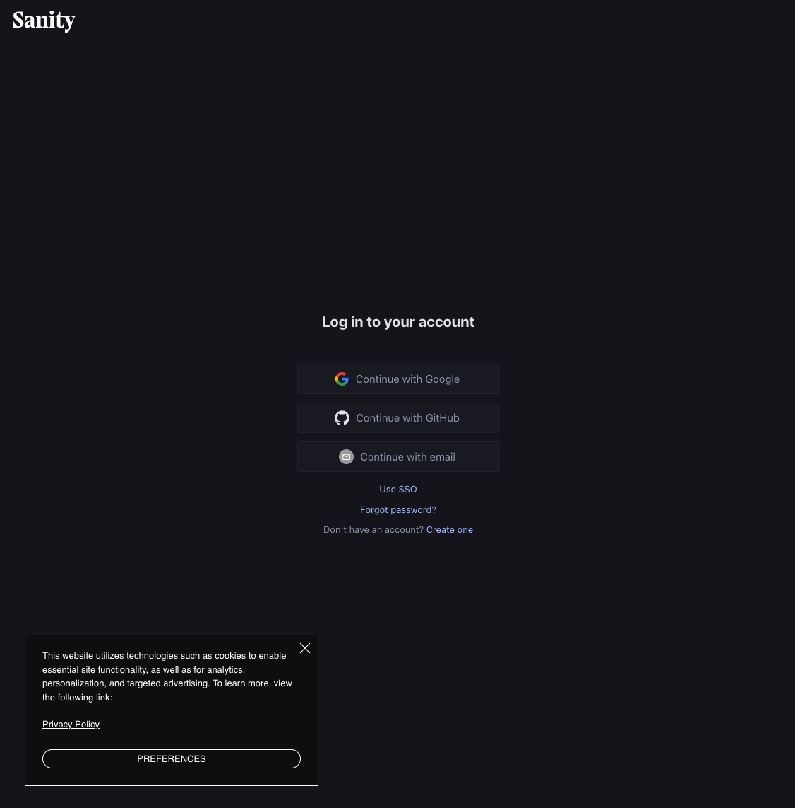
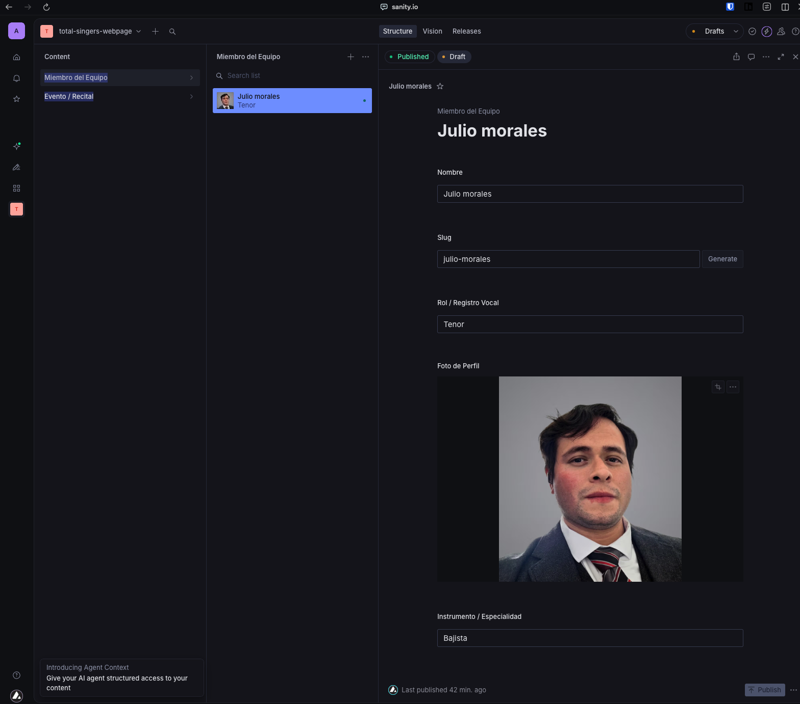
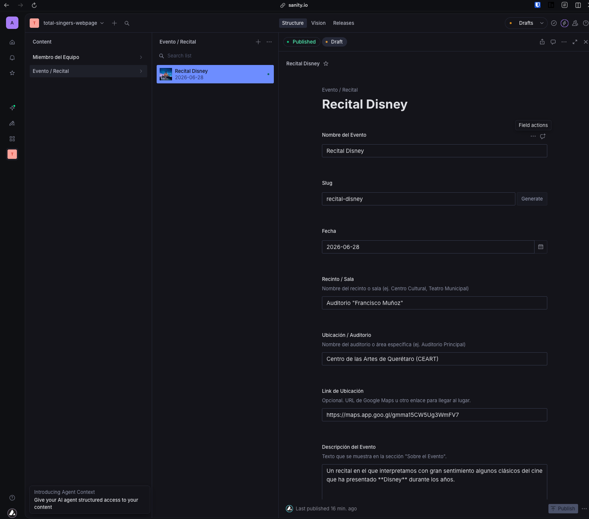
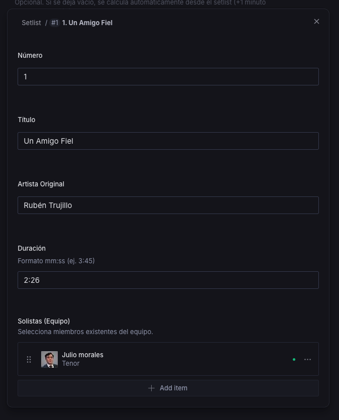
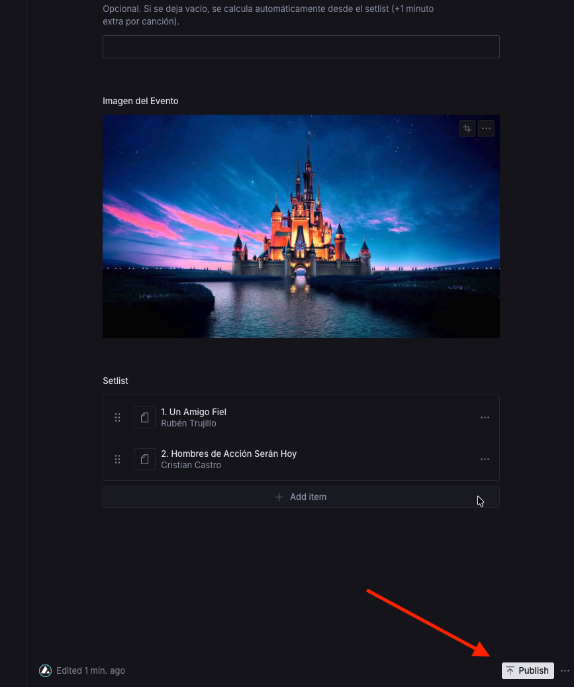

# Guia CMS - Total Singers

Esta guia explica como gestionar contenido en Sanity Studio para el sitio de Total Singers.
Esta orientada a editores, administradores y nuevos colaboradores.

## 1) Acceso rapido

Studio desplegado:

- Produccion: https://total-singers.sanity.studio/production
- Staging: https://total-singers.sanity.studio/staging

Studio local:

```bash
cd studio
npm install
npm run dev
```

En local tambien veras dos workspaces:

- `/production`
- `/staging`

Usa `staging` para pruebas y deja `production` solo para contenido aprobado.



## 2) Modelos de contenido

### Team Member (Miembro del Equipo)

Campos clave:

- `name` (obligatorio)
- `slug` (obligatorio, autogenerado)
- `role` (obligatorio)
- `image` (obligatorio)
- `instrument` (opcional)
- `bio` (opcional)
- `color` (opcional, presets + hex)
- `socialLinks.*` (opcional, solo usuario)

Notas:

- El perfil publico usa `slug`: `/team/:slug`.
- Las redes se completan con usuario, no con URL completa.

### Show (Evento / Recital)

Campos clave:

- `title` (obligatorio)
- `slug` (obligatorio, autogenerado)
- `date` (obligatorio)
- `eventTime` (opcional, `HH:mm`)
- `doorsOpenTime` (opcional, `HH:mm`)
- `estimatedDurationMinutes` (opcional)
- `venue` (obligatorio)
- `location` (obligatorio)
- `locationUrl` (opcional)
- `description` (opcional, markdown)
- `image` (obligatorio)
- `setlist` (opcional)

Campos por cancion (`setlist[]`):

- `number` (obligatorio)
- `title` (obligatorio)
- `artist` (obligatorio)
- `duration` (obligatorio, `mm:ss`)
- `soloistRefs` (opcional, referencias a `teamMember`)

Notas:

- `soloistRefs` evita errores de texto y enlaza a miembros reales.
- En la web, los solistas se muestran como links al perfil.

## 3) Flujo editorial

### Crear o editar miembro

1. Entra a `Miembro del Equipo`.
2. Crea o edita un documento.
3. Sube `image`.
4. Completa datos principales y redes.
5. Publica.



### Crear o editar evento

1. Entra a `Evento / Recital`.
2. Crea o edita un documento.
3. Completa datos generales (titulo, fecha, lugar, horas).
4. Escribe `description` en markdown.
5. Sube imagen.
6. Carga `setlist` y selecciona `soloistRefs`.
7. Publica.







### Eliminar contenido

- Usa `Delete` en el documento.
- Antes de borrar, verifica que no haya links activos apuntando a ese contenido.

## 4) Relacion CMS -> Frontend

Paginas:

- Team: `src/pages/Team.tsx`, `src/pages/SingerDetail.tsx`
- Shows: `src/pages/Shows.tsx`, `src/pages/ShowDetail.tsx`
- Home: destacados de equipo y shows en `src/pages/Home.tsx`

Integracion:

- Cliente Sanity y GROQ: `src/lib/sanity.ts`
- Hook team: `src/hooks/useTeamMembers.ts`
- Hook shows: `src/hooks/useShows.ts`

Comportamientos importantes:

- Horas visibles en formato AM/PM.
- Duracion del programa:
  - Usa `estimatedDurationMinutes` si existe.
  - Si no existe, se calcula desde setlist y suma 1 minuto extra por cancion.

## 5) Entornos y despliegue

### Variables de entorno frontend

- `VITE_SANITY_PROJECT_ID`
- `VITE_SANITY_DATASET`

En Vercel:

- Production -> `VITE_SANITY_DATASET=production`
- Preview -> `VITE_SANITY_DATASET=staging`

Archivos locales:

- `.env` (no versionar)
- `.env.example` (si versionar)

### CORS en Sanity

Agregar origenes permitidos, por ejemplo:

- https://www.totalsingers.com
- https://totalsingers.com
- Preview domain de Vercel (si aplica)

### Promover de staging a production

En el workspace `staging`, cada documento de `Miembro del Equipo` y `Evento / Recital` tiene la accion `Promover a Production`.

Uso recomendado:

1. Edita y revisa el documento en `staging`.
2. Abre el menu de acciones del documento.
3. Ejecuta `Promover a Production`.
4. Confirma la accion.

Notas:

- La accion copia la version actual del documento a `production` y la deja publicada.
- Si el documento ya existe en `production`, se reemplaza por la version de `staging`.
- Las imagenes siguen funcionando porque viven a nivel proyecto, no por dataset.

### Deploy del Studio

```bash
cd studio
npx sanity deploy --url total-singers -y
```

## 6) Cambios de schema (desarrolladores)

Cuando cambies `studio/schemaTypes/*`:

1. Prueba en local (`staging`).
2. Ajusta tipos frontend (`src/types.ts`).
3. Ajusta queries GROQ (`src/lib/sanity.ts`).
4. Verifica TypeScript en frontend y studio.
5. Haz deploy del studio.

```bash
# Frontend
node_modules/typescript/bin/tsc --noEmit --project tsconfig.json

# Studio
cd studio
node_modules/typescript/bin/tsc --noEmit --project tsconfig.json
```

## 7) Checklist rapido para editores

- Crear/editar en `staging` primero.
- Revisar cambios en web preview.
- Publicar o replicar en `production` cuando este aprobado.
- Verificar rutas finales: `/team`, `/team/:slug`, `/shows`, `/shows/:slug`.
